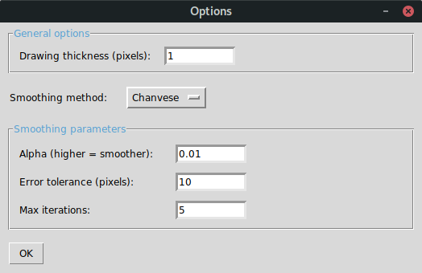

# Usage

ContourizeMe is a GUI script that is invoked from the command line. The main argument to ContourizeMe is the path to the image file the user would like to detect edges in.  

```
usage: ContourizeMe [-h] image

allows the user to slide to a values for 8-bit pixel thresholding

positional arguments:
  image

optional arguments:
  -h, --help  show this help message and exit

```

Various common image formats such as jpg, bmp, tiff, and HDR are supported. For a full listing, [see here](https://docs.opencv.org/4.1.2/d4/da8/group__imgcodecs.html#ga288b8b3da0892bd651fce07b3bbd3a56).

# The GUI

When invoked, ContourizeMe will open two windows - the main window through which you can interact with ContourizeMe, as well as a preview window which will display the chosen image as well as the detected contour in bright green.

## Main Window
The main window when started looks like this:


The top part of the GUI contains a total of six sliders used for threshhold selection. Their usage depends on the selected parameterization (see below), and their labels will update to reflect this.

- Grayscale (default): only the two left-most sliders will be active. They represent the lower and upper threshhold bounds, respectively.
- RGB: the left two sliders represent the lower and upper red-scale bounds, the middle two represent the green-scale bounds, and the right two sliders represent the blue-scale bounds.
- HSV: the left two sliders represent the lower and upper hue-scale bounds, the middle two represent the saturation-scale bounds, and the right two sliders represent the value-scale bounds.

Thresholding is used to identify the object of interest (OOI) in the image. By adjusting the sliders, the user determines the scale values that most closely correspond to the OOI. ContourizeMe then runs edge detection on this OOI. The currently identified OOI is indicated by the bright green line(s) in the image preview window.

The slider labeled "Perimeter per Bezier" sets the approximately desired arc-length of the individual Bezier curves that will be exported to represent the detected edge(s). It may be set to values between 3 and 300.

### Operations

ContourizeMe implements three main parameterizations (grayscale, RGB, HSV) which can be selected with a drop-down menu. The result of this parameterization can be viewed by clicking *Show transformed image*. In addition to these parameterizations, the user can select various blurring filters using the *Transforms* button. The available filters are 

- [average blur](#average-or-box-blur)
- [Gaussian blur](#gaussian-blur)
- [median blur](#median-blur)
- [bilateral filter](#bilateral-filter).

Each of these can be applied to obscure noise in the source image. Multiple transforms may be applied successively to improve the quality of the source image. For more details, see the section on [Filter Settings](#filter-settings) below.

The *Plot* operation will generate a plot of the Bezier curves found by the edge detection algorithm. This gives a preview of the SVG that will be generated. Creating this plot may take a moment, so please be patient after pressing the button.

The SVG is saved by clicking the *Save to SVG* button.

### Options

The options window allows the user to set both general options as well as utilize a smoothing algorithm for the edges found by the edge detection algorithm.



The only currently implemented smoothing method is an OpenCV implementation of the Chan-Vese level set algorithm ([see here](https://doi.org/10.1016/j.patcog.2009.08.002) for details). 


# Filter Settings

## Average or Box Blur

This transform implements an [average blur](https://en.wikipedia.org/wiki/Box_blur). In essence, a box of specified size (the "Kernel Size" parameter) moves over the image and the pixel value of the central element is replaced by the average over the box. The default setting is 5 pixels, which creates a 5x5 box of pixels. Kernel size should be a positive integer.

## Gaussian Blur

This transform implements a [Gaussian blur](https://en.wikipedia.org/wiki/Gaussian_blur). This filter convolves the source image with a Gaussian kernel. The default kernel size is 5, but may be specified by the user. The kernel size should be an odd, positive number. [See here](https://docs.opencv.org/master/d4/d86/group__imgproc__filter.html#gac05a120c1ae92a6060dd0db190a61afa) for details on the kernel. The parameters SigmaX and SigmaY determine the standard deviation of the sampled Gaussian function in the x and y directions, respectively.

## Median Blur
This transform implements a [median blur](https://en.wikipedia.org/wiki/Median_filter). This filter computes the medial of all pixels under the kernel area and replaces the central element by the median value. Kernel size must be an odd, positive integer.

## Bilateral Filter
This transform implements a [bilateral filter](https://en.wikipedia.org/wiki/Bilateral_filter). Kernel size is recommended to be set to an integer between 5 and 9 for this filter. The SigmaColor and SigmaSpace settings can be left the same. For more details, see the [OpenCV documentation](https://docs.opencv.org/master/d4/d86/group__imgproc__filter.html#ga9d7064d478c95d60003cf839430737ed) for this filter.